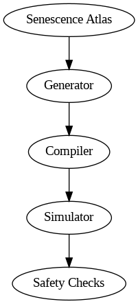

# End-to-End Pipeline - Senolytic AI: Paper 4

The following diagram illustrates the overall workflow:

1. **Senescence Atlas**: Input scRNA-seq and spatial datasets, annotated for senescent vs non-senescent cells.
2. **Generator**: AI-based design of candidate gene circuits using the atlas.
3. **Compiler**: Converts logical specifications into synthetic gene circuits.
4. **Simulator**: In silico testing of circuit behavior (activation, leakiness, burden).
5. **Safety Checks**: Evaluation of off-target effects and overall circuit reliability.

